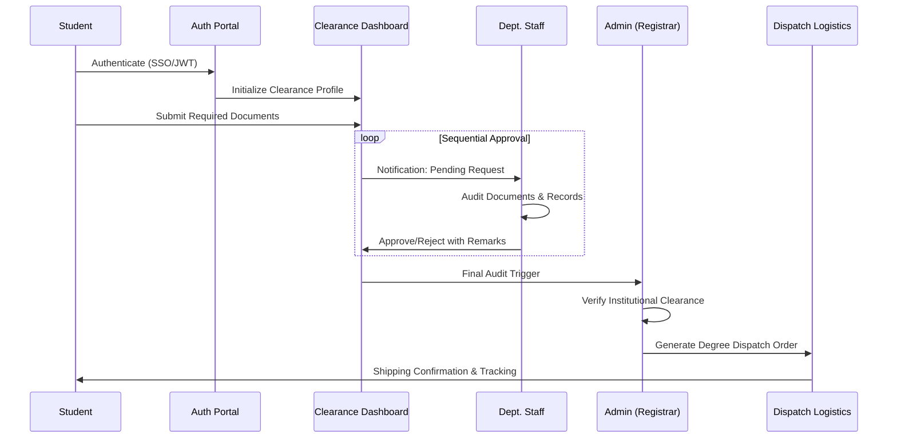
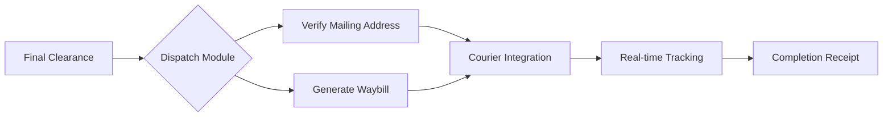

# 🎓 web CUIvehari Clearance

[](https://github.com/)
[](https://opensource.org/licenses/MIT)
[](https://supabase.com/)
[](https://jwt.io/)

> **web CUIvehari Clearance** is a high-performance, enterprise-grade digital ecosystem designed to orchestrate the complex clearance lifecycle of university students. It bridges the gap between academic departments, administrative offices, and the student body through real-time data synchronization and automated logistics.

---

## 📺 Video Demonstrations

For a comprehensive walkthrough of the platform's capabilities, please view the following demonstrations:

| Module | Scope | Link |
| :--- | :--- | :--- |
| **✨ System Overview** | Core Architecture & Student Experience | [Watch Demo 1](https://drive.google.com/file/d/1bqIceq3zo1OPdeKC3zGSh8yMf00wz2qo/view?usp=sharing) |
| **⚙️ Admin & Operations** | Departmental Workflows & Dispatch Logistics | [Watch Demo 2](https://drive.google.com/file/d/1WiW1kRFv5XAoSGH5Vc_RZD9J9E4kfjHi/view?usp=sharing) |

---

## 🔄 Professional Workflows

### 1. Student Clearance Lifecycle
The system enforces a strictly sequenced approval chain to ensure data integrity across all university touchpoints.



### 2. Administrative Logistics Workflow
Managing the "Last Mile" of the student clearance process—degree issuance and shipping.



---

## 💎 Enterprise Features

### 🏢 Multi-Tenant Departmental Management
- **Department Isolation**: Each department (Finance, Library, Transport, etc.) operates in its own secure environment.
- **Role-Based Access Control (RBAC)**: Fine-grained permissions for Staff, HODs, and Administrators.
- **Customizable Requirements**: Departments can define unique clearance criteria and document types.

### 📊 Operational Intelligence (Telemetry)
- **Live Bottleneck Analysis**: Identify departments with high latency in request processing.
- **Student Analytics**: Track clearance velocity and projected completion dates institution-wide.
- **Audit Logs**: Comprehensive history of every approval, rejection, and comment.

### 📦 Logistics & Degree Fulfillment
- **Dispatch Management**: Specialized module for tracking degree shipping status.
- **Automated Communication**: WhatsApp and Email integration for real-time student outreach.
- **Address Verification**: Ensuring degree delivery to verified student residences.

---

## 🛠 Technical Architecture

| Layer | Technology | Purpose |
| :--- | :--- | :--- |
| **Frontend** | React 18 / TypeScript | Type-safe, reactive UI with Vite orchestration. |
| **Styling** | Tailwind CSS / Shadcn | Premium, responsive component design system. |
| **Backend** | Node.js / Express | Scalable RESTful API with middleware protection. |
| **Primary DB** | MongoDB / Mongoose | Flexible document storage for complex clearance data. |
| **Cloud Engine** | Supabase | Real-time database, Auth, and Secure Storage. |
| **Security** | JWT / Bcrypt | Industry-standard session management and hashing. |

---

## 🚀 Infrastructure & Deployment

### Local Development Environment

```bash
# 1. Clone Infrastructure
git clone https://github.com/AlishbaIqbal123/Clearance-Flow.git

# 2. Service Orchestration (Backend)
cd backend && npm install
# Configure .env with MONGODB_URI and JWT_SECRET
npm run dev

# 3. Frontend Hydration
cd ../frontend && npm install
# Configure .env with VITE_API_URL
npm run dev
```

### Production Readiness
- **State Management**: Optimized with robust context and hook-based patterns.
- **Security Headers**: Protected by Helmet.js and custom CORS policies.
- **Database Hardening**: Supabase RLS (Row Level Security) enabled for data privacy.
- **CI/CD**: Prepared for Vercel/Render automated deployment pipelines.

---

## 🤝 Contribution & Support

UCMS is an open ecosystem. We follow strict coding standards and PR review processes to maintain system stability.

- **Coding Standard**: ESLint / Prettier
- **Architecture Style**: Modular Monolith / Component-Driven
- **Support**: alishba1342@gmail.com

---

<p align="center">
  <b>Designed for Modern Institutions. Scaled for Excellence.</b>
  <br>
  <i>© 2026 web CUIvehari Clearance. All rights reserved.</i>
</p>
